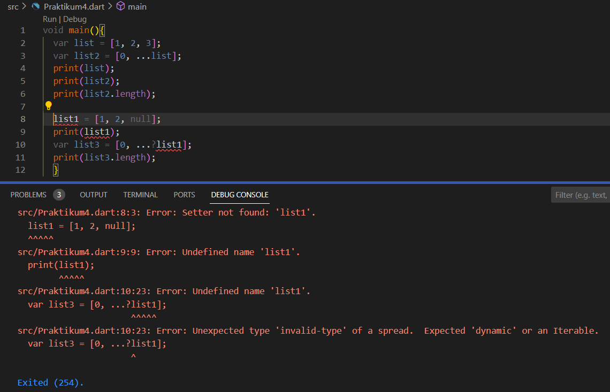
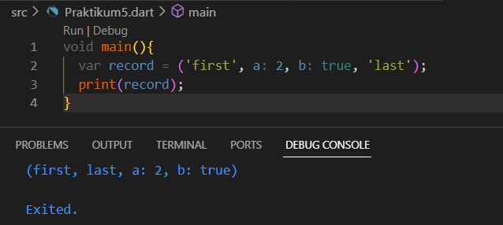

| Nama                                | Kelas | NIM        |
| ----------------------------------- | ----- | ---------- |
| Ulfi Mustatiq Abidatul Izza         | TI-3H | 2141720052 |

# Praktikum 1: Eksperimen Tipe Data List
### Langkah 1

### Langkah 2

***Penjelasan :***
Tidak terdapat error 
- *var list = [1, 2, 3];* terdapat variabel list yang merupakan sebuah array dengan tiga elemen, yaitu 1, 2, 3.
- *assert(list.length == 3);* digunakan memeriksa apakah panjang array list sama dengan 3. Jika tidak, maka akan menghasilkan error. Namun, karena panjang list memang 3, program akan berlanjut.
- *assert(list[1] == 2);* digunakan untuk memeriksa apakah elemen kedua dari array list (indeks 1) sama dengan 2. Jika tidak, akan menghasilkan error. Namun, karena list[1] memang 2, program akan melanjutkan.
- *print(list.length);* mencetak panjang array list ke konsol. Karena panjangnya adalah 3, maka output yang dicetak akan menjadi "3".
- *print(list[1]);* mencetak elemen kedua dari array list (indeks 1) ke konsol. Karena list[1] adalah 2, maka output yang dicetak akan menjadi "2".
- *list[1] = 1;* digunakan untuk mengubah elemen kedua dari array list (indeks 1) dari 2 menjadi 1. Jadi, list sekarang menjadi [1, 1, 3].
- *assert(list[1] == 1);* digunakan untuk memeriksa apakah elemen kedua dari array list (indeks 1) sekarang adalah 1.
- *print(list[1])* digunakan untuk mencetak elemen kedua dari array list (indeks 1) ke konsol. Karena sebelumnya diubah menjadi 1, maka output yang dicetak akan menjadi "1".

### Langkah 3
Ubah kode pada langkah 1 menjadi variabel final yang mempunyai index = 5 dengan default value = null. Isilah nama dan NIM Anda pada elemen index ke-1 dan ke-2. Lalu print dan capture hasilnya.

***Penjelasan :***

Terdapat error karena terdapat inisialisasi nilai tipe String pada elemen yang memiliki tipe Null pada list.
Pada baris *list[1] = 'Ulfi Mustatiq Abidatul Izza';*, dan *list[2] = '2141720052'*.

Untuk mengatasi error ini, dapat dilakukan dengan cara mengubah tipe elemen list menjadi dynamic atau Object, sehingga dapat menerima nilai dengan tipe apapun, termasuk String. Berikut adalah perbaikan kode:

#### PERBAIKAN

- Menggunakan **object?**

- menggunakan **dynamic**

# Praktikum 2: Eksperimen Tipe Data Set
### Langkah 1

## Langkah 2

***Penjelasan :*** Tidak terdapat error
- *var halogens = {'fluorine', 'chlorine', 'bromine', 'iodine', 'astatine'};* pada baris ini terdapat variabel bernama halogens yang merupakan sebuah Set atau daftar list.
- *print(halogens);* pada baris ini digunakan untuk mencetak isi dari Set halogens.

## Langkah 3

***Penjelasan***

Pada hasil kode program diatas menghasilkan names1 dan names2 menghasilkan output {}, menunjukkan bahwa keduanya adalah Set kosong dengan tipe elemen String. dan pada names3 menghasilkan output yang membingungkan karena meskipun tampilannya sama dengan Set kosong, itu sebenarnya adalah sebuah Map kosong, bukan Set.
- *var names1 = <String>{};* : untuk mendefinisikan sebuah Set kosong yang akan berisi string. Tanda {} digunakan untuk mendefinisikan sebuah Set kosong dengan tipe elemen String.
- *Set<String> names2 = {};* : untuk mendefinisikan Set yang kosong dengan tipe elemen String.
- *var names3 = {};* : names3 adalah sebuah Map kosong, bukan Set. ketika hanya menggunakan {} tanpa tipe data, Dart akan menganggapnya sebagai sebuah Map yang kosong, bukan Set. 

#### PERBAIKAN

***Penjelasan***

Kemudian pada langkah ini dilakukan untuk mambahkan elemen nama dan NIM Anda pada kedua variabel Set tersebut dengan dua fungsi berbeda yaitu .add() dan .addAll(). dan untuk variabel Map dihapus.

# Praktikum 3: Eksperimen Tipe Data Maps
### Langkah 1

### Langkah 2

***Penjelasan*** : Tidak terdapat error

Pada kode program diatas menerapkan penggunaan Map (peta) dalam bahasa Dart. Map adalah struktur data yang mengaitkan pasangan kunci (key) dengan nilai (value).

**gifts** adalah sebuah Map yang menghubungkan string sebagai kunci dengan berbagai jenis nilai, termasuk string dan angka:
- Key 'first' memiliki value 'partridge'.
- Key 'second' memiliki value 'turtledoves'.
- Key 'fifth' memiliki value 1.

**nobleGases** adalah sebuah Map yang menghubungkan angka sebagai kunci dengan nilai berupa string dan angka:
- Key 2 memiliki value 'helium'.
- Key 10 memiliki value 'neon'.
- Key 18 memiliki value 2.

Kemudian dilakukan mencetak hasil dari kedua Map yaitu gifts dan nobleGases.

### Langkah 3

***Penjelasan :***

 Pada kode program diatas dilakukan penambahan kode program dengan melakukan perubahan pada nilai dalam Map gifts menggunakan variabel mhs1 dan pada Map nobleGases menggunakan variabel mhs2. Setelah perubahan nilai dilakukan, mencetak nilai dari kedua Map serta menampilkan bahwa kedua variabel mhs1 dan mhs2 merupakan himpunan kosong karena belum diinisialisasi.

#### PERBAIKAN

***Penjelasan :***

Pada Langkah diatas dilakukan perbaikan dari kode sebelumnya dengan melakukan inisialisasi variabel mhs1 dan mhs2. Kemudian juga menambahakan nama dan nim pada setiap variabel sehingga akan menampilkan output seperti diatas.

# Praktikum 4: Eksperimen Tipe Data List: Spread dan Control-flow Operators
### Langkah 1

### Langkah 2

***Penjelasan :***

Terdapat error pada variabel list1 ketika ingin mencetak variabel tersebut karena pada variabel list1 sebelumnya tidak didefinisikan, hanya mendefinisikan variabel list dan list2. Sehingga terdapat peringatan error undefined name 'list' pada baris print(list1);

#### PERBAIKAN

***Penjelasan :***

Pada kode program diatas telah dilakukan perbaikan pada baris print(list1);* yaitu dengan menggatinya dengan print(list); karena pada sebelumnya variabel list yang sudah diinisialisasi.

### Langkah 3

***Penjelasan :***
Terdapat error pada kode program diatas yang disebabkan oleh tidak terdifinisikannya variabel list1.

#### PERBAIKAN

***Penjelasan :***

Pada langkah diatas telah dilakukan perbaikan serta penambahkan variabel list berisi NIM menggunakan Spread Operators.

### Langkah 4

***Pejelasan :***
Terdapat error pada kode program diatas karena pada var promoActive tidak terdefinisikan.

Maka untuk memperbaikinya dilakukan deklarasi pada var promoActive yaitu dengan nilai true, sehingga akan menghasilkan output seperti dibawah ini.

#### PERBAIKAN
- Hasil ketika var promoActive bernilai **true**

- Hasil ketika var promoActive bernilai **false**

### Langkah 5

***Perbaikan :***

Terjadi error pada kode program diatas yang diseabkan oleh var login yang belum terdefinisi.

Sehingga, untuk memperbaikinya dilakukan dengan memberi nilai pada var login yaitu Manager.

#### PERBAIKAN

***Penjelasan :***

Pada langkah diatas dilakukan percobaan apabila var login mempunyai kondisi lain. Maka ketika var login bernnilai false maka, outputnya tidak mencetak 'Inventory'.

### Langkah 6 

***Penjelasan :*** Tidak terjadi error

Pada kode program diatas dilakuka penerapan Collection For pada bahasa Dart, langkah tersebut dilakukan :
- *var listOfInts = [1, 2, 3];*: Ini adalah inisialisasi variabel listOfInts yang merupakan sebuah daftar (list) dengan tiga angka bulat, yaitu 1, 2, dan 3.
- *var listOfStrings = ['#0', for (var i in listOfInts) '#$i'];* : Ini merupakan contoh penggunaan "Collection For". Pada baris ini, membuat variabel listOfStrings yang juga merupakan daftar, tetapi dibuat dengan menggunakan "Collection For". Perhatikan bagian for (var i in listOfInts). Ini berarti sedang melakukan iterasi melalui setiap elemen dalam listOfInts, dan untuk setiap elemen i dalam listOfInts, dibuat sebuah string '#$i' yang menggabungkan karakter "#" dengan nilai i. Hasilnya adalah daftar baru yang berisi string '#0', '#1', dan '#2'.
- *assert(listOfStrings[1] == '#1');*: digunakan untuk memeriksa apakah elemen kedua (indeks 1) dari listOfStrings adalah '#1'. Karena 'listOfStrings' dibuat dengan menggunakan "Collection For", maka ini akan menjadi benar.
- *print(listOfStrings);*: Ini mencetak isi dari listOfStrings ke konsol. Hasilnya adalah ['#0', '#1', '#2'].

Manfaat dari penggunaan "Collection For" adalah menyederhanakan kode dan memungkinkan untuk membuat koleksi baru dengan transformasi pada setiap elemen koleksi yang ada tanpa perlu melakukan perulangan eksplisit dengan for loop.

# Praktikum 5: Eksperimen Tipe Data Records

### Langkah 1 

### Langkah 2

***Penjelasan :*** Tidak terjadi error

Tetapi pada hasil output kode program diatas menampilkan nilai pada var record yang tidak berurutan.

### Langkah 3

***Penjelasan :***

Pada kode program diatas tidak menghasilkan output apapun karena ketika pemanggilan fungsi tukar terdapat peringatan baha fungsi tersebut belum ada.

Sehingga untuk memperbaiknya dilakukan penambahan fungsi tukar yang menggunakan List. dan juga memberi nilai pada var record yaitu 1 dan dua kemudian dilakukan pemanggilan fungsi tukar untuk menukar nilai pada var record a dan b.

#### PERBAIKAN

### Langkah 4

***Penjelasan :***

Pada kode program diatas terjadi error yang disebabkan pada variabel record mahasiswa yang tidak memiliki nilai apapun tetapi dilakuak print untuk cetak nilai dari variabel mahasiswa tersebut.

Sehingga untuk memperbaikinya dilakukan dengan menambahkan nilai pada variabel record mahasiswa yaitu dengan nama dan NIM.

##### PERBAIKAN

### Langkah 5

***Penjelasan :*** Tidak terjadi error

Pada kode program diatas mencetak nilai dari var record mahasiswa2 sesuai dengan index yang dipanggil.

***Penjelasan :***

Pada langkah diatas dilakukan penambahan record dengan nama dan NIM, kemudian dilakukan pemanggilan index untuk dilakukan print.

# Tugas Praktikum

### 1. Jelaskan yang dimaksud Functions dalam bahasa Dart!

***Jawab***

Fungsi dalam bahasa Dart adalah blok kode yang digunakan untuk menjalankan tugas tertentu. Fungsi sering digunakan untuk mengelompokkan kode agar lebih terorganisir dan dapat digunakan kembali. Berikut adalah beberapa poin penting tentang fungsi dalam bahasa Dart:
- *Deklarasi Fungsi*: Anda dapat mendeklarasikan fungsi dalam Dart dengan menggunakan kata kunci void jika fungsi tidak mengembalikan nilai atau dengan menyebutkan tipe data yang akan dikembalikan jika fungsi mengembalikan nilai. Contoh:

- *Pemanggilan Fungsi*: Anda dapat memanggil fungsi dengan menggunakan nama fungsi diikuti oleh tanda kurung. Jika fungsi mengembalikan nilai, Anda dapat menyimpannya dalam variabel atau menggunakan nilainya langsung. Contoh:

- *Parameter*: Fungsi dapat menerima parameter sebagai input. Parameter adalah nilai yang diperlukan oleh fungsi untuk melakukan operasi tertentu. Contoh:

- *Nilai Pengembalian*: Beberapa fungsi mengembalikan nilai. Anda dapat menggunakan kata kunci return untuk mengembalikan nilai dari fungsi tersebut. Contoh:

### 3. Jelaskan jenis-jenis parameter di Functions beserta contoh sintaksnya!

***Jawab***

a. Required Parameters (Parameter Wajib)
- Parameter ini harus selalu diberikan saat memanggil fungsi.
- Dideklarasikan tanpa tanda kurung siku [] atau kurung kurawal {}.

b. Named Parameters (Parameter Beri Nama)
- Parameter ini memiliki nama yang harus disebutkan saat memanggil fungsi.
- Dideklarasikan dengan tanda kurung kurawal {} dan nama parameter diikuti oleh tipe data opsional.

c. Default Parameters (Parameter Default):
- Parameter ini memiliki nilai default yang akan digunakan jika nilai tidak disediakan saat memanggil fungsi.
- Dideklarasikan dengan menggunakan = untuk memberikan nilai default.

d. Positional Parameters (Parameter Berdasarkan Posisi):
- Parameter ini tidak memiliki nama dan bergantung pada urutan posisi saat memanggil fungsi.
- Dideklarasikan tanpa tanda kurung siku [] atau kurung kurawal {}.

e. Rest Parameters (Parameter Sisa):
- Parameter ini memungkinkan Anda untuk mengambil sejumlah argumen dalam bentuk daftar (list) atau himpunan (set) sebagai satu parameter.
- Dideklarasikan dengan menggunakan tiga titik ... diikuti oleh nama parameter.

### 4. Jelaskan maksud Functions sebagai first-class objects beserta contoh sintaknya!

***Jawab***

Dalam bahasa Dart, fungsi dianggap sebagai objek tingkat pertama (first-class objects). Artinya, fungsi dapat digunakan dan diperlakukan seperti objek lainnya, seperti variabel, argumen fungsi, dan nilai kembali fungsi. Berikut contoh sintaksisnya:

- Fungsi Sebagai Variabel : Fungsi dapat disimpan dalam variabel dan digunakan seperti variabel lainnya.

- Fungsi Sebagai Argumen Fungsi : Fungsi juga dapat diteruskan sebagai argumen ke fungsi lain.

- Fungsi Sebagai Nilai Kembali Fungsi : Fungsi dapat mengembalikan fungsi lain sebagai nilai kembali.

- Fungsi Anonim : Dart juga mendukung pembuatan fungsi anonim, yaitu fungsi tanpa nama. Fungsi anonim dapat disimpan dalam variabel atau digunakan sebagai argumen fungsi.

### 5. Apa itu Anonymous Functions? Jelaskan dan berikan contohnya

***Jawab***

Anonymous functions, juga dikenal sebagai lambda functions atau fungsi tanpa nama, adalah fungsi yang tidak memiliki nama yang terikat secara langsung. Dalam bahasa Dart, anonymous functions digunakan ketika kita ingin mendefinisikan fungsi sederhana yang tidak perlu diberi nama atau digunakan sebagai argumen fungsi. Berikut adalah contoh penggunaan Anonymous Functions :

### 6. Jelaskan perbedaan Lexical scope dan Lexical closures! Berikan contohnya!

***Jawab***

Lexical scope dan lexical closures adalah konsep penting dalam bahasa Dart yang berkaitan dengan pengaturan akses variabel dalam fungsi. Berikut adalah penjelasan perbedaan antara keduanya beserta contohnya:

a. **Lexical Scope:**
- Lexical scope adalah aturan yang mengatur ketersediaan variabel berdasarkan tempat penulisan kode dalam struktur berjenjang seperti fungsi atau blok.
- Variabel yang dideklarasikan di dalam suatu scope dapat diakses oleh kode di dalam scope tersebut dan oleh kode di dalam scope yang mengelilinginya (scope yang mengandungnya).
- Variabel yang dideklarasikan di luar scope tidak dapat diakses oleh kode di dalam scope tersebut.
- Ini mengikuti aturan "dekat dengan dekat" di mana lingkup akses variabel ditentukan oleh tempat penulisan kode.

Pada contoh di atas, variabel count dideklarasikan di dalam fungsi main(). Fungsi increment() yang juga didefinisikan di dalam main() dapat mengakses variabel count karena variabel tersebut berada dalam lexical scope yang mengelilingi increment(). Variabel count dapat diakses dan dimodifikasi oleh fungsi increment().

b. **Lexical Closures:**
Lexical closures adalah konsep yang terkait dengan lexical scope di mana sebuah fungsi yang dideklarasikan di dalam scope dapat "mengambil" dan "mengingat" variabel yang berada dalam scope yang mengelilinginya, bahkan setelah scope tersebut selesai dieksekusi.
Lexical closures memungkinkan fungsi tersebut untuk mengakses dan menggunakan variabel yang tidak lagi ada di dalam lingkup saat fungsi dipanggil.
Ini berguna ketika fungsi tersebut perlu mengakses variabel yang diingat untuk keperluan tertentu, seperti callback atau pengolahan data.

Pada contoh di atas, fungsi createMultiplier() mengembalikan anonymous function yang menggunakan variabel multiplier dari lexical closure. Setelah fungsi createMultiplier() selesai dieksekusi, variabel multiplier tidak lagi ada dalam lingkup utama. Namun, anonymous function yang dihasilkan masih dapat mengakses dan menggunakan nilai multiplier yang diingat dari lexical closure. Dalam contoh ini, kita membuat dua fungsi baru, double dan triple, yang masing-masing mengalikan angka yang diberikan dengan 2 dan 3.

### 7. Jelaskan dengan contoh cara membuat return multiple value di Functions!

***Jawab***

Dalam bahasa Dart, fungsi secara default hanya dapat mengembalikan satu nilai. Namun, terdapat beberapa cara untuk mengembalikan beberapa nilai dari sebuah fungsi. Berikut adalah beberapa contoh cara membuat return multiple value di Dart:

a. **Menggunakan List atau Array**: dapat menggunakan List atau Array untuk mengembalikan beberapa nilai dari sebuah fungsi. Dapat menyusun nilai-nilai tersebut dalam List atau Array, dan kemudian mengembalikan List atau Array tersebut sebagai nilai kembali dari fungsi.

b. **Menggunakan Map**: dapat menggunakan Map untuk mengembalikan beberapa nilai dengan menggunakan pasangan kunci-nilai. Dapat membuat Map, menetapkan nilai-nilai ke kunci tertentu, dan kemudian mengembalikan Map tersebut sebagai nilai kembali dari fungsi.

c. **Menggunakan Class atau Object**:  dapat membuat sebuah class atau object yang mengelompokkan beberapa nilai dan mengembalikan instance class atau object tersebut sebagai nilai kembali dari fungsi.
